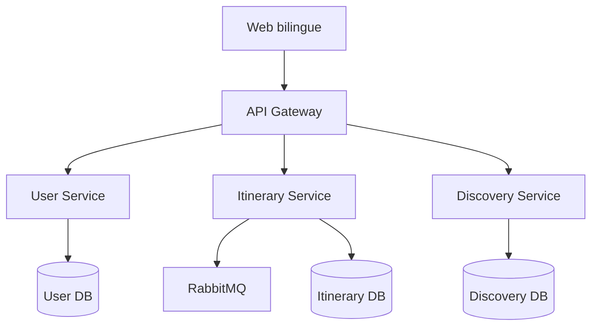

# Architecture

## Vue d’ensemble

Cameroon Project avance en deux étapes. La première réduit les dépendances pour tester les parcours. La seconde sépare les domaines métier afin qu’ils puissent évoluer indépendamment.

## Phase 1 — prototype validé

Le frontend Vinext/React embarque un catalogue TypeScript. Les préférences de langue et l’itinéraire sont conservés dans `localStorage`. Trois routes JSON offrent une première surface d’intégration. Cette forme permet une démonstration autonome et rapide.

## Phase 2 — services autonomes

| Composant | Responsabilité | Données possédées |
| --- | --- | --- |
| API Gateway | Routage, limites de débit, en-têtes de sécurité | Aucune donnée métier |
| User Service | Profils et rôles | Utilisateurs |
| Itinerary Service | Création, modification, partage et suppression | Itinéraires et étapes |
| Discovery Service | Catalogue, recherche, recommandations et publication | Destinations |
| RabbitMQ | Événements asynchrones d’itinéraire | Messages temporaires |

Chaque service expose son propre document OpenAPI et possède une base PostgreSQL distincte. Il est interdit à un service de lire directement la base d’un autre service.

## Flux importants

### Recherche

1. Le navigateur appelle `/api/v1/discovery/destinations`.
2. La passerelle applique les contrôles réseau puis transfère la demande.
3. Discovery Service filtre uniquement les contenus publiés.

### Modification d’un itinéraire

1. L’identité vérifiée est transmise par la passerelle dans `X-User-ID`.
2. Itinerary Service limite la requête aux données de ce propriétaire.
3. La transaction PostgreSQL est confirmée.
4. Un événement `itinerary.created`, `itinerary.updated` ou `itinerary.deleted` est envoyé à RabbitMQ.

## Décisions techniques

- REST/JSON simplifie l’intégration du projet et produit automatiquement OpenAPI.
- PostgreSQL fournit contraintes, transactions et JSONB pour les étapes ordonnées.
- RabbitMQ découple les futurs usages : statistiques, notifications ou suggestions.
- Docker Compose rend l’architecture reproductible sur une seule machine.
- Les événements sont complémentaires : la réussite de l’écriture REST ne dépend pas d’une disponibilité parfaite du bus.

## Étapes suivantes

1. Connecter le frontend aux routes `/api/v1` derrière la même origine.
2. Ajouter une authentification OIDC/JWT à la passerelle.
3. Remplacer la création de schéma au démarrage par des migrations versionnées.
4. Ajouter traces distribuées, métriques, sauvegardes testées et déploiement orchestré.

